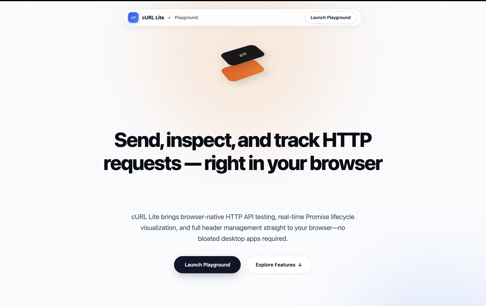
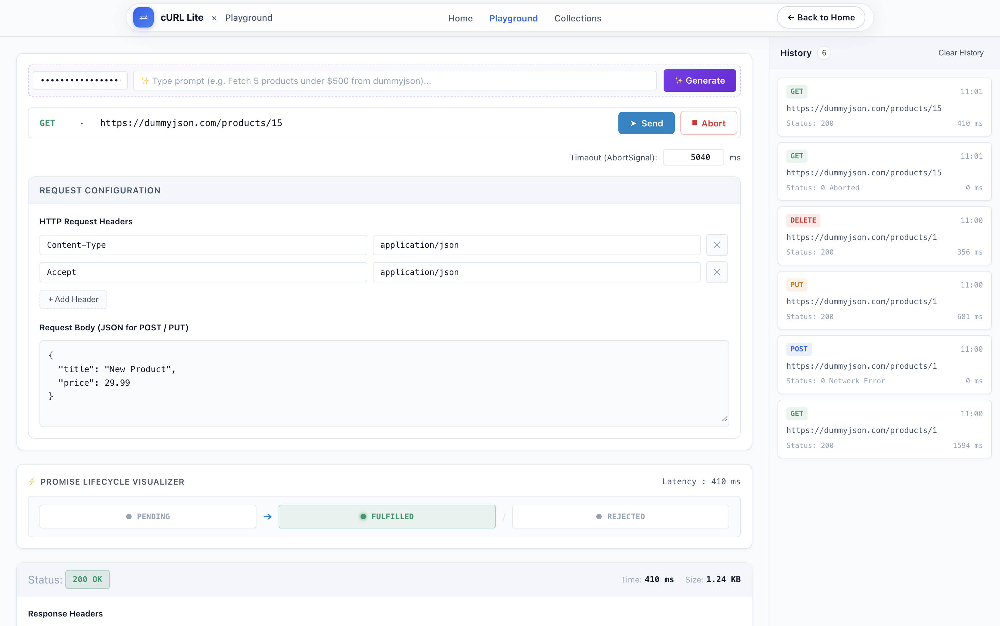
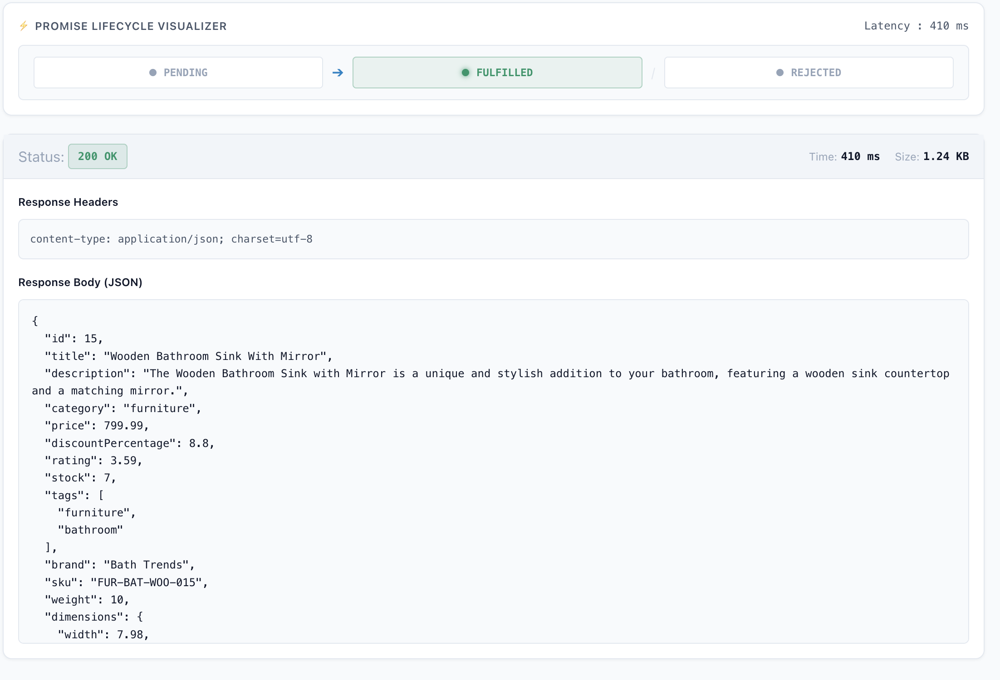
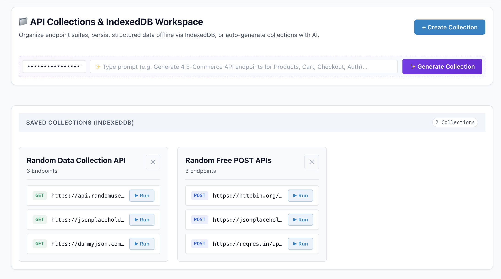

# cURL Lite — Visual HTTP Request Playground


---

## Project Specs

<table>
  <tr>
    <td></td>
    <td></td>
  </tr>
  <tr>
    <td></td>
    <td></td>
  </tr>
</table>


---

## Project Proposal

### Title
**cURL Lite — Visual HTTP Request Playground**

### Description
cURL Lite is a lightweight, browser-native HTTP API testing tool built entirely with vanilla HTML, CSS, and JavaScript. It allows developers to compose, send, and inspect real HTTP requests directly in the browser — without any backend, build pipeline, or desktop application. A unique Promise Lifecycle Visualizer shows the live state transitions (PENDING → FULFILLED / REJECTED) of each asynchronous `fetch()` call, making it as much a learning tool as a productivity tool.

### Goals
- Provide a zero-setup alternative to API clients like Postman for quick HTTP testing.
- Visually demonstrate JavaScript Promise lifecycle states in real time.
- Persist request history, form drafts, and user preferences using browser storage APIs.
- Enable AI-assisted request generation and collection building via the ASI Cloud LLM API.
- Organize reusable endpoint suites into named Collections backed by IndexedDB.

### Specifications

**Tech Stack:** Vanilla HTML5, CSS3 (Custom Properties, Flexbox, CSS Grid), Vanilla JavaScript (ES6+, async/await, Fetch API, AbortController, IndexedDB, localStorage, sessionStorage, Cookies)

**Core Features:**
- HTTP request builder (GET, POST, PUT, DELETE)
- Dynamic headers editor (add/remove key-value rows)
- JSON request body editor
- Configurable request timeout via `AbortSignal`
- Promise Lifecycle Visualizer (PENDING / FULFILLED / REJECTED)
- Response inspector (status badge, latency, response headers, formatted JSON body)
- Persistent request history (up to 20 entries, stored in `localStorage`)
- One-click history restore — loads any past request back into the form
- Session-draft auto-save (`sessionStorage`) — survives accidental tab refreshes
- Timeout preference persistence (browser Cookie, 30-day expiry)
- AI-assisted request generation (ASI Cloud `asi1-mini` model)
- API Collections manager with full CRUD via IndexedDB
- AI-assisted collection suite generation
- Deep-link support — Playground loads pre-filled via URL query params (`?url=&method=`)

**Pages:** Landing (`index.html`), Playground (`playground.html`), Collections (`collections.html`)

**Design Approach:** Clean, minimal light theme using a curated color palette defined via CSS Custom Properties. System font stack with monospace (`JetBrains Mono / Fira Code`) for code surfaces. Glassmorphism navbar (`backdrop-filter: blur`). Animated hero with cycling headline text. CSS Grid two-column layout on desktop, single-column on tablet/mobile.

---

## Overview

cURL Lite removes friction from browser-based API testing. The Playground page provides a Postman-like interface — method selector, URL bar, headers editor, body textarea, timeout control — that uses the native browser Fetch API to fire real HTTP requests. Every request is logged to `localStorage`; clicking any history entry restores the full configuration back into the form. A dedicated Collections page stores named groups of API endpoints in IndexedDB, and both pages integrate an optional AI bar that talks to the ASI Cloud inference API to auto-generate requests or whole endpoint suites from natural-language prompts.

---

## Features

### HTTP Request Execution
- Select HTTP method: **GET, POST, PUT, DELETE**
- Enter any target URL
- Configure a request timeout (ms) backed by `AbortController` / `AbortSignal`
- Abort an in-flight request manually via the **Abort** button
- Body is sent only for POST / PUT (GET and DELETE are body-stripped automatically)

### Dynamic Headers Editor
- Pre-populated with `Content-Type: application/json` and `Accept: application/json` rows on load
- Add unlimited key-value header rows dynamically via DOM manipulation (`createElement`)
- Remove individual rows with the ✕ button (event delegation on the container)
- Headers serialized into a plain object and passed directly to `fetch()`

### Promise Lifecycle Visualizer
- Three-state pipeline indicator: **PENDING** (amber pulse animation) → **FULFILLED** (green) / **REJECTED** (red)
- Updates in real time as the async `fetch()` call progresses
- Latency displayed in the visualizer header after each request

### Response Inspector
- HTTP status code + status text badge (green for 2xx, red for errors/abort)
- Response time in milliseconds (measured with `performance.now()`)
- Response headers rendered as key-value pairs
- Formatted JSON body (`JSON.stringify` with 2-space indent) in a scrollable `<pre><code>` block

### Request History (Read, Clear)
- Up to 20 entries persisted in `localStorage` under key `curl-lite-history`
- Each entry stores: method, URL, status, duration, timestamp, body, headers
- Sidebar lists entries as clickable cards; clicking restores the full request into the form
- **Clear History** button wipes the `localStorage` entry and re-renders the empty state

### Session Draft Auto-Save
- Form state is serialized and written to `sessionStorage` on every `input` / `change` event
- On page load, the draft is restored automatically (overridden if URL query params are present)
- Draft is cleared after a successful request submission

### Cookie-Based Preferences
- The **Timeout** field value is written to a browser cookie (`curl_lite_timeout`, 30-day expiry) on change
- Loaded back and applied on page initialization

### Collections CRUD (IndexedDB)
- **Create:** Modal form (`+ Create Collection`) saves a named collection with optional description to IndexedDB
- **Read:** All collections loaded from IndexedDB on page mount and rendered as cards
- **Delete:** ✕ button on each card removes the record from IndexedDB and re-renders the grid
- Each collection card lists its endpoint items with method tags and **▶ Run** links that deep-link to the Playground

### AI Assistant
- **Playground:** Natural-language prompt → structured HTTP request config (method, URL, headers, body) auto-populated into the form
- **Collections:** Natural-language prompt → full collection object (name + array of request configs) saved directly to IndexedDB
- Powered by **ASI Cloud inference API** (`asi1-mini` model, OpenAI-compatible `/v1/chat/completions`)
- API key stored in `localStorage` (`curl-lite-ai-key`), persists across sessions
- Animated glowing purple UI state during generation (`ai-generating` CSS class with `@keyframes`)

---

## Tech Stack

| Layer | Technology |
|---|---|
| Markup | HTML5 — semantic elements (`header`, `main`, `aside`, `section`, `article`, `nav`, `footer`) |
| Styling | Vanilla CSS3 — Custom Properties, Flexbox, CSS Grid, `@keyframes`, `backdrop-filter` |
| Logic | Vanilla JavaScript (ES6+) — `async/await`, Fetch API, `AbortController`, `performance.now()` |
| Storage (History) | `localStorage` |
| Storage (Draft) | `sessionStorage` |
| Storage (Preferences) | Browser Cookies |
| Storage (Collections) | IndexedDB — raw `indexedDB` API, no third-party wrapper |
| AI Integration | ASI Cloud inference API (`https://inference.asicloud.cudos.org/v1/chat/completions`) |
| External Libraries | **None** — zero dependencies, no npm, no frameworks |
| Fonts | System font stack + `JetBrains Mono / Fira Code` (monospace, system-loaded) |

---

## Project Structure

```
cURL_Lite/
├── index.html              # Landing / marketing page
├── playground.html         # Playground page (main app)
├── collections.html        # Collections manager page
│
├── css/
│   ├── style.css           # App stylesheet (Playground + Collections)
│   └── landing.css         # Landing page stylesheet (isolated)
│
├── js/
│   ├── api.js              # Fetch execution, AbortController, AI request helpers
│   ├── app.js              # Form logic, event wiring, draft/cookie/AI setup
│   ├── ui.js               # DOM rendering (history, response, lifecycle, headers editor)
│   ├── storage.js          # localStorage, sessionStorage, and Cookie utilities
│   ├── db.js               # Full IndexedDB CRUD layer (openDB, save, get, update, delete)
│   ├── collections.js      # Collections page logic (render, modal, AI assistant)
│   └── landing.js          # Hero title cycling animation
│
├── README.md
├── .gitignore
└── RequestLab_Beginner_Build_Guide.docx
```

---

## Pages Overview

### `index.html` — Landing Page
The entry point / marketing page. Features a dot-grid background with ambient gradient glow blurs, a floating glassmorphism capsule navbar, and a 3D isometric CSS illustration built entirely with CSS transforms. The hero headline cycles through five descriptive taglines using a fade in/out animation loop driven by `landing.js`. A features section below showcases three core capabilities via a responsive `auto-fit` grid. No JavaScript storage interactions occur on this page.

**Scripts:** `landing.js`

---

### `playground.html` — Playground
The main application page. Layout is a CSS Grid with a **main workspace** column (scrollable) and a fixed-width 340px **history sidebar**. The workspace contains four primary sections stacked vertically:

1. **AI Prompt Bar** — optional natural-language input to generate request configs via ASI Cloud
2. **Request Builder** — method dropdown, URL input, Send/Abort buttons, timeout control, headers editor, JSON body textarea
3. **Promise Lifecycle Visualizer** — real-time PENDING / FULFILLED / REJECTED state display with latency
4. **Response Inspector** — status badge, timing metrics, response headers, formatted JSON body

The sidebar lists past requests from `localStorage`; clicking any card repopulates the entire form including headers.

**Scripts:** `api.js`, `storage.js`, `ui.js`, `app.js`

---

### `collections.html` — Collections
A single-column centered layout (max-width 1100px) for managing named API endpoint suites. Contains:

1. **Collections Header Bar** — title, description, and `+ Create Collection` button
2. **AI Collection Generator Bar** — prompt input to auto-generate and save a collection via ASI Cloud
3. **Collections Grid** — responsive `auto-fill` grid of collection cards; each card shows the collection name, endpoint count, and a list of endpoints with method tags and **▶ Run** deep-links to the Playground

Creating a collection opens a modal dialog (form with name + description fields) that writes to IndexedDB on submit. Deleting a collection removes it from IndexedDB and re-renders the grid immediately.

**Scripts:** `api.js`, `storage.js`, `db.js`, `collections.js`

---

## Data Storage

Four separate browser storage mechanisms are used, each serving a distinct purpose:

### 1. `localStorage` — Request History & AI API Key

| Key | Purpose |
|---|---|
| `curl-lite-history` | Array of up to 20 past request objects (method, URL, status, duration, timestamp, headers, body) |
| `curl-lite-ai-key` | User's ASI Cloud API key (persists across sessions) |

Managed in `js/storage.js` via `saveHistory()`, `loadHistory()`, `clearHistoryData()`, `saveAIKey()`, `loadAIKey()`.

### 2. `sessionStorage` — Form Draft

| Key | Purpose |
|---|---|
| `curl-lite-draft` | Serialized snapshot of the current form state (method, URL, headers, body, timeout) |

Written on every `input` / `change` event and cleared after a successful request submission. Restored on page load unless URL query params are present. Managed via `saveDraft()`, `loadDraft()`, `clearDraft()` in `js/storage.js`.

### 3. Browser Cookies — User Preferences

| Cookie Name | Purpose | Expiry |
|---|---|---|
| `curl_lite_timeout` | Last-used request timeout value (ms) | 30 days |

Written via `setCookie()` / read via `getCookie()` in `js/storage.js`. Uses `SameSite=Lax` and `path=/`.

### 4. IndexedDB — Collections

- **Database:** `cURL_Lite_DB` (version 1)
- **Object Store:** `collections` (auto-increment integer primary key `id`)
- **Operations:** `openDB()`, `saveCollectionToDB()`, `getAllCollectionsFromDB()`, `getCollectionById()`, `updateCollection()`, `deleteCollectionFromDB()`
- All operations are Promise-wrapped over the raw `indexedDB` API — no third-party library used.
- Managed entirely in `js/db.js`.

---

## Responsive Design

Two breakpoints are defined in `css/style.css`:

### ≤ 1024px (Tablet)
```css
@media (max-width: 1024px) { ... }
```
- The two-column CSS Grid (`1fr 340px`) collapses to a **single column** (`1fr`)
- The history sidebar loses its left border and gets a top border instead, capped at `max-height: 350px`

### ≤ 640px (Mobile)
```css
@media (max-width: 640px) { ... }
```
- Main workspace padding reduced (`24px → 14px`)
- URL bar wraps to multiple lines (`flex-wrap: wrap`), action buttons fill full width
- Header rows collapse to a tighter grid (`1fr 1fr 28px`)
- Promise Lifecycle track switches to **vertical** layout (`flex-direction: column`), arrows rotate 90°
- AI Prompt Bar stacks vertically; API key input fills full width

The landing page (`css/landing.css`) has a single breakpoint at `≤ 640px` adjusting hero padding and footer layout. Both stylesheets use `clamp()` for fluid typography on the landing page hero title and subtitle.

---

## How to Run Locally

No build tools, bundlers, or package managers are required.

**1. Clone the repository:**
```bash
git clone https://github.com/Samanyu3482/cURL_Lite.git
cd cURL_Lite
```

**2. Serve locally** (IndexedDB requires a proper HTTP origin — `file://` will not work):

Option A — VS Code Live Server:
Install the [Live Server extension](https://marketplace.visualstudio.com/items?itemName=ritwickdey.LiveServer), right-click `index.html`, and select **Open with Live Server**.

Option B — Python:
```bash
python3 -m http.server 8080
# Open http://localhost:8080/index.html
```

Option C — Node.js:
```bash
npx serve .
# Follow the URL printed in the terminal
```

**3. Navigate the app:**
- Start at `index.html`
- Click **Launch Playground** → `playground.html`
- Click **Collections** in the nav → `collections.html`

**4. (Optional) Enable AI features:**
Enter your [ASI Cloud](https://inference.asicloud.cudos.org) API key in the AI Prompt Bar on the Playground or Collections page. The key is saved to `localStorage` automatically.

---

## Future Improvements

1. **Response syntax highlighting** — Integrate a lightweight syntax highlighter (e.g., Prism.js) to color-code JSON keys, strings, and numbers in the response body panel.
2. **Export / Import Collections** — Allow users to export collections as a JSON file and re-import them, enabling sharing between browsers without a backend.
3. **Environment Variables** — Add a key-value store for named variables (e.g., `{{BASE_URL}}`, `{{TOKEN}}`) that auto-substitute into URL and header fields before sending.

---

## Author / Credits

**Project:** cURL Lite — Visual HTTP Request Playground  
**Repository:** [github.com/Samanyu3482/cURL_Lite](https://github.com/Samanyu3482/cURL_Lite)

Built as part of the **UCA PROJECTS WEB DEVELOPMENT - PROJECT - 1** programme.

- AI inference powered by [ASI Cloud (Cudos)](https://inference.asicloud.cudos.org) using the `asi1-mini` model
- No third-party UI frameworks or component libraries were used
- All storage, networking, and rendering logic is implemented with native browser APIs
